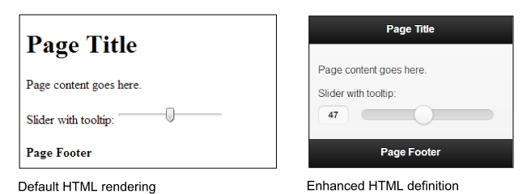
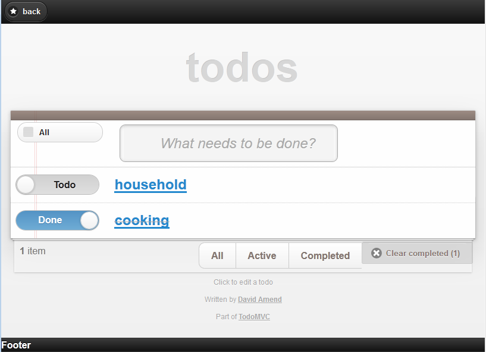
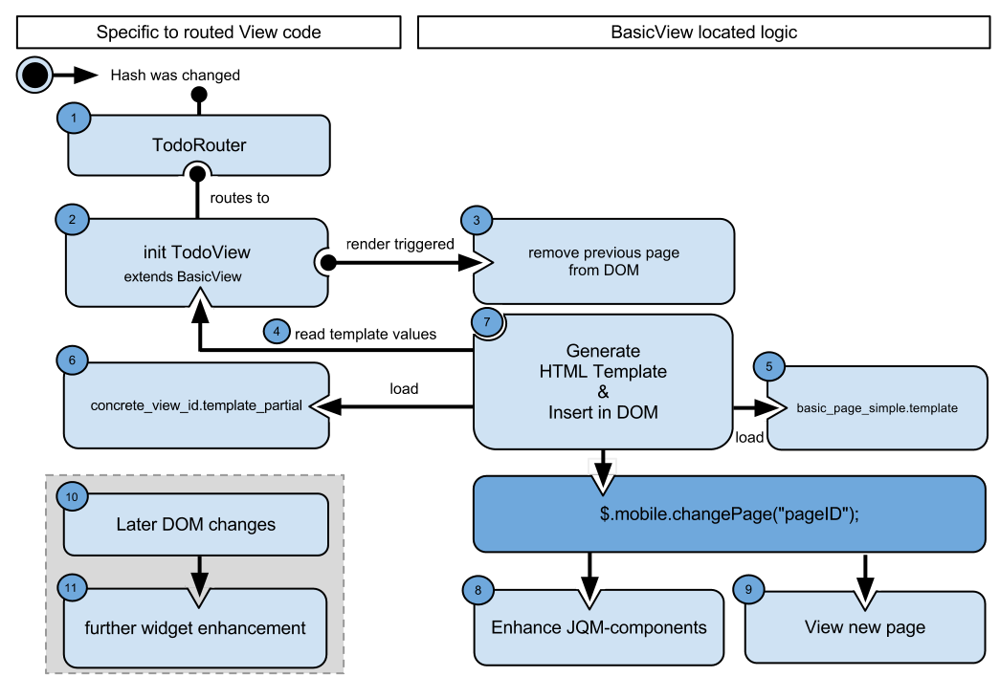
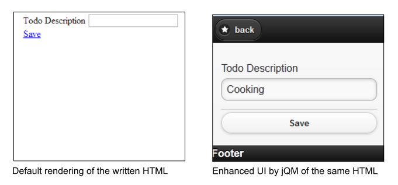

## Backbone & jQuery Mobile

### Mobile app development with JavaScript

The mobile web is huge and it is continuing to grow at an impressive rate. Along with the massive growth of the mobile internet comes a striking diversity of devices and browsers. As a result, making your applications cross-platform and mobile-ready is both important and challenging.
Creating native apps is expensive.
It is very costly in terms of time and it usually requires varied experiences in programming languages like Objective C , C#, Java and JavaScript to support multiple runtime environments.

HTML, CSS, and JavaScript enables you to build an app only once. Because of the common runtime environment, the browser, it supports a broad band of mobile devices such as tablets, smartphones, notebooks or PCs.

The challenging task is not only to adopt contents like text and pictures properly to various screen resolutions but also to have same user experience across native apps by different operating systems.
Like jQueryUI, jQuery Mobile is a user interface framework, based on jQuery that works across all popular phones, tablet, e-reader, and desktop platforms. Built with accessibility and universal access in mind. 


The main idea of the framework is to enable anybody creating mobile apps, even without the knownledge of a programming language and no need to write complex, device specific CSS, but HTML only.
For this reason jQMobile follows two main principles, we first need to understand to be able to integrate the framework to Backbone.


#### 1. Principle of progressive widget enhancement

JQuery Mobile follows a "progressive enhancement" and responsive web design principle by HTML-5 markup-driven definitions and configurations.

A page in jQuery Mobile consists of an element with a data-role="page" attribute.
Within the "page" container, any valid HTML markup can be used, but for typical pages in jQM, the immediate children of a "page" are divs with data-roles of "header", "content", and "footer".
The baseline requirement for a page is only the page wrapper to support the navigation system, the rest is optional.

A initial HTML page would look like:

```html
<!DOCTYPE html>
<html>
<head>
	<title>Page Title</title>

	<meta name="viewport" content="width=device-width, initial-scale=1">

	<link rel="stylesheet" href="http://code.jquery.com/mobile/1.3.0/jquery.mobile-1.3.0.min.css" />
	<script src="http://code.jquery.com/jquery-1.9.1.min.js"></script>
	<script src="http://code.jquery.com/mobile/1.3.0/jquery.mobile-1.3.0.min.js"></script>
</head>
<body>

<div data-role="page">

	<div data-role="header">
		<h1>Page Title</h1>
	</div>
	<div data-role="content">
		<p>Page content goes here.</p>
              <form>
                   <label for="slider-1">Slider with tooltip:</label>
                   <input type="range" name="slider-1" id="slider-1" min="0" max="100" value="50" data-popup-enabled="true">
              </form>
 	</div>
	<div data-role="footer">
		<h4>Page Footer</h4>
	</div>
</div>
</body>
</html>
```

JQuery Mobiles will transform the written HTML definition by the progressive widget enhancement API. See the results below:



#### 2. Principle of the navigation system.


The navigation system controls its application lifecycle by automatically 'hijacking' standard links and form submissions and turning them into an AJAX request.
Whenever a link is clicked or a form is submitted, that event is automatically intercepted and is used to issue an AJAX request based on the href or form action instead of reloading the page. 

When the requested page loads, jQuery Mobile parses the document for an element with the data-role="page" attribute and inserts that code into the DOM of the original page.
Next, any widgets in the incoming page are enhanced to apply all the styles and behavior. The rest of the incoming page is discarded so any scripts, stylesheets or other information will not be included.

Roughly speaking, having its own event cycle, it is a tiny MVC framework which enables features like progressive widget enhancement, prefetching, cacheing and multi-page templating by HTML configurations, innately.
In general, the developer does not need to know about its event-workflow, but only about how to apply HTML based configurations, which will take action within the event phase.
The chapter "Intercept jQuery Mobile events" explains, goes into detail, how to handle special scenarios, when fine grained JavaScript adaptiona need to be applied.


To e.g. navigate to the "secondpage" with the appearance of a modal dialog with fade-transition, the data-rel="dialog", data-transition="fade" and href="index.html#secondpage" attributes can be added to the anchor tag.
Via the multi-page templating feature, you can add as many pages as you want to the same HTML file within the body-tag, by defining a div with a data-role "page" or "dialog" and the id, being the value of the link after the hashbang like 

```html
<div data-role="dialog" id="secondpage"> ... </div>
```


Throughout "Developing Backbone.js Applications" content, we learned how to use and benefit from the Backbone-Router, -Views, -Events and -Model, such as advanced plugins and customized JavaScript programming.

The first major hurdle developers typically run into when building applications with jQuery Mobile and a M* framework is that they will have their own opinions about how to handle application navigation.
The same is true for Backbone.

To combine Backbone and jQuery Mobile, we first need to disable the navigation system and the progressive enhancement of jQuery Mobile.
The second step will be to make usage of the custom API of jQM to apply configurations and enhance components by different techniques in the application lifecycle of Backbone.


For a further introduction and explanation about jQuery Mobile basics visit:

http://view.jquerymobile.com/1.3.0/docs/intro/
http://view.jquerymobile.com/1.3.0/docs/widgets/pages/
http://view.jquerymobile.com/1.3.0/docs/intro/rwd.php

### Basic Backbone app setup for jQuery Mobile



The mobile app example presented in the following is build upon the existing codebase of the "TodoMVC Backbone-Require.js” of the chapter "Modular Development" and is enhanced to support jQuery Mobile.

Apart from that it makes use of Grunt-BBB ( see the chapter ackbone Boilerplate and Grunt-BBB) and Handlebars.js like explained in the "Throrax"-chapter. Additional utilities useful for mobile applications will be provided, which can be easily combined and extended.


The initial load of the files to load by Require.js is as follows:

1. "jQuery"
2. "Underscore/Lodash"
3. "handlebars.compiled"
   By opening the console in the project directory and running the Grunt-Backbone command "bbb watch" in the console, 
   it will combine and compile all template files to dist/debug/handlebars_packaged.
4. TodoRouter (instantiates specific views)
5. "jQueryMobile"
6. "JqueryMobileCustomInitConfig"
7. Instantiation of the Backbone Router


Files instantiated, when redirected from the Backbone-Router are:

a) <b>"BasicView.js" and "basic_page_simple.template"</b>
   
   The BasicView is responsible for the Handlebars multipage-template processing.
   Last, it calls the jQuery Mobile API "$.mobile.changePage", when Backbone.View.render is applied 
   to handle page navigation and progressive widget enhancement.
   
b) <b>Concrete view with its template partial</b>

    E.g. "EditTodoPage.js" and "editTodoView.template_partial"
    
    

The head of index.html needs to load the "jquerymobile.css" as well as the "base.css", 
which is being used by all Todo-MVC apps, and the "index.css" for some project specific custom CSS.

```html
<html>
<head>
    <meta charset="utf-8">
    <meta http-equiv="X-UA-Compatible" content="IE=edge,chrome=1">
    <meta name="viewport" content="width=device-width,initial-scale=1">

    <title>TodoMVC Jquery Mobile</title>

    <link rel="stylesheet" href="/assets/css/jquerymobile.css">
    <link rel="stylesheet" href="/assets/css/base.css">
    <link rel="stylesheet" href="/assets/css/index.css">
</head>

<body>
    <script data-main="/app/config" src="/assets/js/libs/require.js"></script>
</body>
</html>
```


### Delegating jQuery Mobile navigation to Backbone


By delegating routing and navigation functionalities of the jQuery Mobile Framework to Backbone, we can profit from its clear separation of application structure to later on easily share application logic between a desktop webpage, tablets and mobile apps.

Backbone.Router offers an explicit way to define custom navigation routes. Whilst jQuery Mobile encourages the use of URL hash fragments to reference separate pages or views in the same document.
Some of the ideas that have been previously proposed to work-around this problem included manually patching Backbone and jQuery Mobile.

The solution demonstrated below, will not only simplify the handling of the jQuery Mobile component initialization event-cycle, but also enables the usage of the existing Backbone’s Router functionalities.

To adopt the navigation control from jQuery Mobile to Backbone, we first need to apply some specific setting to the mobileinit event, after the framework was loaded to e.g. disable the jQM navigation controller (Flow of Component interactions, Step 1).

A suggested configuration with its descriptions is listed below:

```javascript
$(document).bind("mobileinit", function(){
// Disable jQM routing and component creation events
// disable hash-routing
$.mobile.hashListeningEnabled = false;
// disable anchor-control
$.mobile.linkBindingEnabled = false;
// can cause calling object creation twice and back button issues are solved
$.mobile.ajaxEnabled = false;
// Otherwise after mobileinit, it tries to load a landing page
$.mobile.autoInitializePage = false;
// we want to handle caching and cleaning the DOM ourselves
     	$.mobile.page.prototype.options.domCache = false;
// consider due to compatibility issues
// not supported by all browsers
$.mobile.pushStateEnabled = false;
// Solves phonegap issues with the back-button
$.mobile.phonegapNavigationEnabled = true;
//no native datepicker will conflict with the jQM component
$.mobile.page.prototype.options.degradeInputs.date = true;
});
```



Whenever the hash URL was changed, e.g. by clicking the link, the configuration prevented jQM to trigger its events. Instead, the Backbone Router listens to the hash changes and decides which view to request.

However, experience has shown that,  it is a good practice for mobile pages, to create prototypes(superclasses) for various situations like the usage of the jQuery Validation Plugin or popups with jQM.
Then it becomes much easier to exchange device specific view logics, at runtime, and adopt general strategies- This would also help to add syntax and to support multi chaining of prototype inheritance with JavaScript and Backbone. The “Backbone_Super”(see https://github.com/lukasolson/Backbone-Super) function is loaded by Require.js. A parent function can be called with this._super('save', arguments);

By creating a “BasicView” of superclass, we enable all inherited-view-pages to share a common way to handle jQM specific view handling and the common usage of a template engine.

```javascript
define([
    "lodash",
    "backbone",
    "handlebars",
    "handlebars_helpers"
],

function (_, Backbone, Handlebars) {
    var BasicView = Backbone.View.extend({
        initialize: function () {
            _.bindAll();
            this.render();
        },
        events: {
            "click #backButton": "goBackInHistory"
        },
        role: "page",
        attributes: function () {
            return {
                "data-role": this.role
            };
        },
        getHeaderTitle: function () {
            return this.getSpecificTemplateValues().headerTitle;
        },
        getTemplateID: function () {
            return "basic_page_simple";
        },
        goBackInHistory: function (clickEvent) {
            history.go(-1);
            return false;
        },
        getTemplateResult: function (templateDefinitionID, templateValues) {
            return window.JST[templateDefinitionID](templateValues);
        },
        getBasicPageTemplateResult: function () {
            var templateValues = {
                templatePartialPageID: this.id,
                headerTitle: this.getHeaderTitle()
            };
            var specific = this.getSpecificTemplateValues();
            $.extend(templateValues, this.getSpecificTemplateValues());
            return this.getTemplateResult(this.getTemplateID(), templateValues);
        },
        getRequestedPageTemplateResult: function () {
            this.getBasicPageTemplateResult();
        },
        render: function () {
            this.cleanupPossiblePageDuplicationInDOM();
            $(this.el).html(this.getBasicPageTemplateResult());
            this.addPageToDOMAndRenderJQM();
            this.enhanceJQMComponentsAPI();
        },
        enhanceJQMComponentsAPI: function () {
            $.mobile.changePage("#" + this.id, {
                changeHash: false,
                role: this.role
            });
        },
        addPageToDOMAndRenderJQM: function () {
            $("body").append($(this.el));
            $("#" + this.id).page();
        },
        // Instead you could move it to the event "pagehide": or "onPageHide"
        cleanupPossiblePageDuplicationInDOM: function () {
            var $previousEl = $("#" + this.id);
            var alreadyInDom = $previousEl.length >= 0;
            if (alreadyInDom) {
                $previousEl.detach();
            }
        }
    });

    return BasicView;
});
```

The previous jQuery Mobile page from the DOM should be removed prior to the triggering of 'render'; this is done in order to avoid any duplication.

JQuery Mobile supports the concept of Multipage Templates( see http://view.jquerymobile.com/1.3.0/docs/widgets/pages/), where you can organize your entire markup into a single HTML page body.
To follow the DRY(Don’t repeat yourself) concept, it is advised to register the basic anatomy of jQM pages, popups and dialogs in a separate HTML template file.
In the build progress of Grunt/Yeoman, the semantic templates will be compiled by Handlebar.js and the AMDs template files are combined into a single file.

In the next step, the 'basic_page_simple' template, consisting of a common jQM page anatomy, will be loaded. ( see line _ of code).
As you can see, it also contains a manual implementation to handle the back buttons action as well as some console outputs for development.

```javascript
<div data-role="header">
        {{whatis "Specific loaded Handlebars parameters:"}}
        {{whatis this}}
        <h2>{{headerTitle}}</h2>
        <a id="backButton" href="href="javascript:history.go(-1);" data-icon="star" data-rel="back" >back</a>
    </div>
    <div data-role="content">
        {{whatis "Template page trying to load:"}}
        {{whatis templatePartialPageID}}
        {{> templatePartialPageID}}
    </div>
    <div data-role="footer">
        {{footerContent}}
</div>
```

The overridden 'id'-attribute in the concrete view will be taken as the id of the jQM page as well as the templatePartialPageID of the file.
In the case of the 'EditTodoPage”-View( see Image: 'Todo Editing View' ) the name of the templatePartialPageID file is by convention:
'editTodoPage.template_partial'.
This can be changed in the grunt handlebars plugin configurations in the “grunt.js” file.

Some commonly used parameters, such as headerTitle, footer description and the “data-role”-attribute (e.g. “page”, “dialog”, or  popup) will be placed in the template as well.

Additional dynamic template parameters e.g. Backbone Model information, will be taken from the specific View and merged with the ones from the BasicView.

As a result, a concrete View might look like:

```javascript
define([
    "backbone", "modules/view/abstract/BasicView"],
    function (Backbone, BasicView) {
        return BasicView.extend({
            id : "editTodoView",
            getHeaderTitle : function () {
                return "Edit Todo";
            },
            getSpecificTemplateValues : function () {
                return this.model.toJSON();
            },
            events : function () {
                return _.extend({
                    'click #saveDescription' : 'saveDescription'
                }, this.constructor.__super__.events);
            },
            saveDescription : function (clickEvent) {
                this.model.save({
                    title : $("#todoDescription", this.el).val()
                });
                return true;
            }
        });
    });
```

After the dynamic HTML is added to the DOM( step _), “$.mobile.changePage” has to be applied. It is the most important API call, because it triggers the jQuery Mobile component creation of the current page and displays it.

This is done in the enhanceJQMComponentsAPI function

```javascript
$.mobile.changePage("#" + this.id, {
                changeHash: false,
                role: this.role
            });
```

To retain control of hash routing, “changeHash” has to be set to false as well as the proper “role”-parameter to guarantee right page appearance.

Always make sure to progress component enrichment of a newly added HTML-fragment into the DOM, to guarantee correct appearance of the mobile components.



Consider the following HTML declaration of the editing Todo page, the input looks like follows:

```javascript
<a id="saveDescription" href="#" data-role="button" data-mini="true">Save</a>
```
will be translated to the HTML below with additional CSS.
```javascript
<a data-mini="true" data-role="button" href="#" id="saveDescription"   data-corners="true" data-shadow="true" data-iconshadow="true" data-wrapperels="span" data-theme="c" class="ui-btn ui-shadow ui-btn-corner-all ui-mini ui-btn-up-c">
    <span class="ui-btn-inner">
         <span class="ui-btn-text">Save</span>
     </span>
</a>
```

For the basic use cases, it is advised, always to render the complete page by calling $.mobile.changePage on component enhancements.

One must be very careful, when creating a partial HTML code and updating the values on UI elements, the next section will display how to handle such situations.

### Applying advanced jQM techniques to Backbone

#### Dynamic DOM Scripting


The solution described above solves the issues of handling routing with Backbone by calling $.mobile.changePage('pageID'). Additionally, it is guaranteed, that the HTML page will be completely enhanced by the markup of jQuery Mobile.

The second tricky part with jQuery Mobile is to dynamically manipulate specific DOM contents (e.g. after loading in content with Ajax). We suggest you use this technique, only if there is evidence for an appreciable performance gain.
With the current version 1.3, jQM provides three ways, documented and explained below in the official API, on forums and blogs.
( for further information see http://stackoverflow.com/questions/14468659/jquery-mobile-document-ready-vs-page-events/ and http://jquerymobile.com/test/docs/pages/page-scripting.html)

* <b>$(“pageId”).trigger(“pagecreate”)</b>
  <p>Creates markup of header, content as well as footer</p>
* <b>$(“anyElement”).trigger(“create”)</b>
  <p>Creates markup of the element as well as all children</p>
* <b>$(“myListElement”).listview(“refresh”)</b>
  <p>Every component of jQM offers plugins methods to
    update the state of specific UI elements.
    Sometimes, when creating a component from scratch, the following error can occur 'cannot call methods on listview prior to initialization'.
    This can be avoided, with component initialization prior to markup enhancement, by calling it in the following way:
    $('#mylist').listview().listview('refresh')
    </p>

To see more details and enhancements for further scripting pages of JQM it’s worth to read their API and follow the release notes, frequently.
( e.g. http://stackoverflow.com/questions/14550396/jquery-mobile-markup-enhancement-of-dynamically-added-content

#### Model-Binding with jQuery Mobile

If you consider using a Model-Binding Plugin, you will need to come up with an automated mechanism to enrich single components.

After having a look on the previous section about 'Dynamic DOM Scripting',
it might not be acceptable, to completely recreate a component (e.g a Listview), which takes longer time to load and to reduce the complexity of event-delegation.
Instead, the component specific plugins, which will only update the needed parts of the HTML and CSS, should be used.
In the case of a Listview, you would need to call the following function to update the list of added, edited, or removed entries:

$('#mylist').listview()

You need to come up with a detection of the component type to decide which plugin method needs to be called. The jQuery Mobile Angular.js Adapter provides such a strategy and solution as well.( see
https://github.com/tigbro/jquery-mobile-angular-adapter/blob/master/src/main/webapp/integration/jqmWidgetPatches.js)

#### Intercept jQuery Mobile events

In special situations you would probably need to to take action to a triggered jQuery Mobile event, which can be done like this:

```javascript
$('#myPage').live('pagebeforecreate', function(event){
         console.log(page was inserted into the DOM');
   	//run your own enhancement scripting here...
          // prevent the page plugin from making its manipulations
  	return false;
});

$('#myPage').live('pagecreate', function(event){
          console.log(‘page was enhanced by jQM');
});
```
In such scenarios, it is important to know when the jQuery Mobile events occurs. The following diagram and the API depicts the event-cycle.


An alternative is the jQuery Mobile Router project, which you might need to replace with the Backbone Router. With the help of jQM-Router project, you could achieve a powerful way to intercept and route one of the various jQM events. It is an extension to jQuery Mobile, which can be used independenly.
If you intend to use it, consider 'Backbone.js Custom Builds' to exclude the router code (see http://gregfranko.com/backbone/customBuild/). This might save ~ 25%, out of the max compressed size of 17,1 KB.

#### Performance

Performance is a sensible topic on mobile devices.
jQuery Mobile provides various tools, to create performance logs, which gives you a good overview about the actual time spend to routing logic, component enhancement, and visual effects.
(check https://github.com/jquery/jquery-mobile/tree/master/tools and http://www.objectpartners.com/2012/11/02/use-jquery-mobile%E2%80%99s-tools-suite-to-help-you-debug-and-improve-your-jquery-mobile-application/)


Depending on the device, the time spend on transitions can take up to 90% load time. To disable transitions all over, you can eighter pass the transition ‘none’ to $.mobile.changePage(), or add settings in the configuration code block:

```javascript
$(document).bind("mobileinit", function(){
…
// Otherwise, depending on Takes up to 90% of loadtime
        	$.mobile.defaultPageTransition = "none";
$.mobile.defaultDialogTransition = "none";
    });
  })
```

To have a more finegrained configuration consider platform dependant settings ( see http://backbonefu.com/2012/01/jquery-mobile-and-backbone-js-the-ugly/ for further information:

```javascript
var iosDevice =((navigator.userAgent.match(/iPhone/i))
|| (navigator.userAgent.match(/iPod/i))) ? true : false;

  $.extend(  $.mobile , {
    slideText :  (iosDevice) ? "slide" : "none",
    slideUpText :  (iosDevice) ? "slideup" : "none",
    defaultPageTransition:(iosDevice) ? "slide" : "none",
    defaultDialogTransition:(iosDevice) ? "slide" : "none"
  });
```

#### Multi platform support management
The reality is that we don't always have the scope to create per-device experiences, so today's application will attempt to optimize the devices or browsers most likely to access it.
It is essential, that the content the application exposes, is readily available to all users, regardless of what browser they are accessing it from, so this principle will be kept in mind during the design phase.
We will be aiming to create a solution that is responsive from the start and jQuery Mobile simplifies a lot of the actual heavy lifting here as it supports responsive layouts, out of the box (including browsers that do not support media queries).
Many developers forget that jQM is a UI framework not dissimilar to jQuery UI. It is using the widget factory and is capable for being used for a lot more than we accredited.

If you have a look on the jQuery Mobile showcase(http://jquerymobile.com/demos/1.2.0/docs/forms/forms-all-mini.html), in a desktop browser, it doesn’t look anything like a mobile application. The accordeons, date-pickers, sliders - everything in the desktop UI is re-using what jQM would be providing users on mobile devices. Especially if you enable the attribute “data-mini” on components, you’ll not realize any difference.
Thanks to some media queries, the desktop UI can make optimal use of whitespace, expanding component blocks out and providing alternative layouts whilst still making use of jQM as a component framework.

The benefit of this is that you don’t need to go pulling in jQuery UI separately to be able to take advantage of these features. Thanks to the recent ThemeRoller the components can look pretty much exactly how I would like them to and users of the app can get a jQM UI for lower-resolutions and a jQM-ish UI for everything else.

The takeaway here is just to remember that if you’re not (already) going through the hassle of conditional script/style loading based on screen-resolution (using matchMedia.js etc), there are simpler approaches that can be taken to cross-device component theming.
